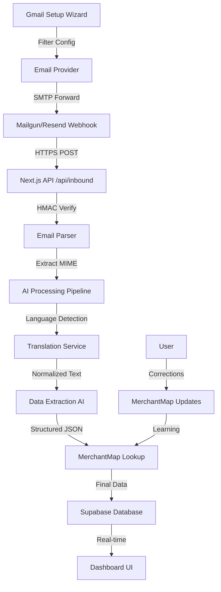

# Design Document

## Overview

ChiPhi AI is built as a Next.js application with a multi-layered architecture that processes receipt emails through an AI pipeline. The system uses Supabase for authentication, database, and real-time features, while implementing a secure email ingestion workflow with HMAC verification. The AI processing pipeline includes language detection/translation, structured data extraction, and machine learning from user corrections.

## Architecture

### High-Level Architecture



### Technology Stack

- **Frontend**: Next.js 14 (App Router), shadcn/ui, Recharts, Tailwind CSS
- **Backend**: Next.js API Routes, Server Actions
- **Database**: Supabase (PostgreSQL with RLS)
- **Authentication**: Supabase Auth (Magic Link)
- **Email Processing**: Mailgun/Resend webhooks, mailparser library
- **AI Services**: OpenAI GPT-4 (Language detection, translation, extraction)
- **Real-time**: Supabase Realtime subscriptions

## Components and Interfaces

### 1. Email Ingestion Layer

#### Webhook Endpoint (`/api/inbound`)
```typescript
interface InboundEmailRequest {
  signature: string;
  timestamp: string;
  token: string;
  'body-mime': string;
  'message-id': string;
  recipient: string;
  sender: string;
  subject: string;
}

interface ParsedEmail {
  messageId: string;
  from: string;
  to: string;
  subject: string;
  text: string;
  html: string;
  attachments: Attachment[];
  headers: Record<string, string>;
}
```

#### HMAC Verification Service
```typescript
interface HMACVerifier {
  verifySignature(
    signature: string,
    timestamp: string,
    token: string,
    body: string
  ): boolean;
}
```

### 2. AI Processing Pipeline

#### Language Normalizer
```typescript
interface LanguageNormalizer {
  detectLanguage(text: string): Promise<string>;
  translateToEnglish(text: string, sourceLanguage: string): Promise<{
    translatedText: string;
    originalText: string;
    confidence: number;
  }>;
}
```

#### Data Extractor
```typescript
interface ReceiptData {
  date: string;
  amount: number;
  currency: string;
  merchant: string;
  last4: string | null;
  category: string;
  subcategory: string | null;
  notes: string | null;
  confidence: number;
  explanation: string;
}

interface DataExtractor {
  extractReceiptData(normalizedText: string): Promise<ReceiptData>;
}
```

#### MerchantMap Service
```typescript
interface MerchantMapping {
  merchantName: string;
  category: string;
  subcategory?: string;
  orgId: string;
  createdBy: string;
  updatedAt: Date;
}

interface MerchantMapService {
  lookupMapping(merchant: string, orgId: string): Promise<MerchantMapping | null>;
  updateMapping(mapping: MerchantMapping): Promise<void>;
  applyMapping(receiptData: ReceiptData, mapping: MerchantMapping): ReceiptData;
}
```

### 3. Database Layer

#### Core Tables
```sql
-- Organizations for multi-tenancy
CREATE TABLE orgs (
  id UUID PRIMARY KEY DEFAULT gen_random_uuid(),
  name TEXT NOT NULL,
  created_at TIMESTAMPTZ DEFAULT NOW(),
  updated_at TIMESTAMPTZ DEFAULT NOW()
);

-- Users with org membership
CREATE TABLE users (
  id UUID PRIMARY KEY REFERENCES auth.users(id),
  email TEXT NOT NULL,
  full_name TEXT,
  created_at TIMESTAMPTZ DEFAULT NOW()
);

CREATE TABLE org_members (
  org_id UUID REFERENCES orgs(id) ON DELETE CASCADE,
  user_id UUID REFERENCES users(id) ON DELETE CASCADE,
  role TEXT NOT NULL DEFAULT 'member',
  created_at TIMESTAMPTZ DEFAULT NOW(),
  PRIMARY KEY (org_id, user_id)
);

-- Email aliases for receipt forwarding
CREATE TABLE inbox_aliases (
  id UUID PRIMARY KEY DEFAULT gen_random_uuid(),
  org_id UUID REFERENCES orgs(id) ON DELETE CASCADE,
  alias_email TEXT UNIQUE NOT NULL,
  is_active BOOLEAN DEFAULT TRUE,
  created_at TIMESTAMPTZ DEFAULT NOW()
);

-- Raw email storage
CREATE TABLE emails (
  id UUID PRIMARY KEY DEFAULT gen_random_uuid(),
  org_id UUID REFERENCES orgs(id) ON DELETE CASCADE,
  message_id TEXT UNIQUE NOT NULL,
  from_email TEXT NOT NULL,
  to_email TEXT NOT NULL,
  subject TEXT,
  raw_content TEXT NOT NULL,
  parsed_content JSONB,
  processed_at TIMESTAMPTZ,
  created_at TIMESTAMPTZ DEFAULT NOW()
);

-- Processed transactions
CREATE TABLE transactions (
  id UUID PRIMARY KEY DEFAULT gen_random_uuid(),
  org_id UUID REFERENCES orgs(id) ON DELETE CASCADE,
  email_id UUID REFERENCES emails(id) ON DELETE CASCADE,
  date DATE NOT NULL,
  amount DECIMAL(10,2) NOT NULL,
  currency TEXT NOT NULL DEFAULT 'USD',
  merchant TEXT NOT NULL,
  last4 TEXT,
  category TEXT NOT NULL,
  subcategory TEXT,
  notes TEXT,
  confidence INTEGER NOT NULL CHECK (confidence >= 0 AND confidence <= 100),
  explanation TEXT NOT NULL,
  original_text TEXT,
  translated_text TEXT,
  source_language TEXT,
  created_at TIMESTAMPTZ DEFAULT NOW(),
  updated_at TIMESTAMPTZ DEFAULT NOW()
);

-- Merchant learning system
CREATE TABLE merchant_map (
  id UUID PRIMARY KEY DEFAULT gen_random_uuid(),
  org_id UUID REFERENCES orgs(id) ON DELETE CASCADE,
  merchant_name TEXT NOT NULL,
  category TEXT NOT NULL,
  subcategory TEXT,
  created_by UUID REFERENCES users(id),
  created_at TIMESTAMPTZ DEFAULT NOW(),
  updated_at TIMESTAMPTZ DEFAULT NOW(),
  UNIQUE(org_id, merchant_name)
);
```

### 4. Frontend Components

#### Dashboard Components
```typescript
interface DashboardProps {
  orgId: string;
  dateRange: { start: Date; end: Date };
}

interface TransactionListProps {
  transactions: Transaction[];
  onCategoryUpdate: (id: string, category: string) => void;
}

interface InsightsProps {
  orgId: string;
  onInsightQuery: (query: string) => Promise<InsightResult>;
}
```

#### Gmail Setup Wizard
```typescript
interface GmailWizardProps {
  aliasEmail: string;
  onComplete: () => void;
}

interface WizardStep {
  title: string;
  description: string;
  instructions: string[];
  verification?: () => Promise<boolean>;
}
```

## Data Models

### Transaction Model
```typescript
interface Transaction {
  id: string;
  orgId: string;
  emailId: string;
  date: Date;
  amount: number;
  currency: string;
  merchant: string;
  last4?: string;
  category: string;
  subcategory?: string;
  notes?: string;
  confidence: number;
  explanation: string;
  originalText?: string;
  translatedText?: string;
  sourceLanguage?: string;
  createdAt: Date;
  updatedAt: Date;
}
```

### Email Processing State
```typescript
interface EmailProcessingState {
  messageId: string;
  status: 'received' | 'parsing' | 'translating' | 'extracting' | 'completed' | 'failed';
  progress: number;
  error?: string;
  startedAt: Date;
  completedAt?: Date;
}
```

## Error Handling

### Email Processing Errors
```typescript
enum ProcessingErrorType {
  HMAC_VERIFICATION_FAILED = 'hmac_verification_failed',
  EMAIL_PARSE_FAILED = 'email_parse_failed',
  TRANSLATION_FAILED = 'translation_failed',
  EXTRACTION_FAILED = 'extraction_failed',
  DATABASE_ERROR = 'database_error',
  RATE_LIMIT_EXCEEDED = 'rate_limit_exceeded'
}

interface ProcessingError {
  type: ProcessingErrorType;
  message: string;
  details?: Record<string, any>;
  retryable: boolean;
}
```

### Error Recovery Strategy
- **Transient Errors**: Implement exponential backoff retry mechanism
- **Permanent Errors**: Log error, notify user, store email for manual review
- **Rate Limiting**: Queue emails for processing when limits reset
- **Partial Failures**: Save partial data with confidence flags

## Testing Strategy

### Unit Testing
- **Email Parser**: Test MIME parsing with various email formats
- **AI Services**: Mock AI responses for consistent testing
- **HMAC Verification**: Test signature validation with known keys
- **Data Extraction**: Test JSON schema validation
- **MerchantMap**: Test learning and lookup logic

### Integration Testing
- **Email-to-Transaction Flow**: End-to-end processing pipeline
- **Database Operations**: RLS policy enforcement
- **Real-time Updates**: Supabase subscription handling
- **Authentication**: Multi-tenant access control

### E2E Testing (Playwright)
```typescript
// Test email processing workflow
test('receipt email processing', async ({ page }) => {
  // Setup: Create test org and user
  // Send test email via webhook
  // Verify transaction appears in dashboard
  // Test category correction
  // Verify MerchantMap learning
});

// Test Gmail setup wizard
test('gmail integration setup', async ({ page }) => {
  // Navigate to setup wizard
  // Follow step-by-step instructions
  // Verify filter configuration
  // Test email forwarding
});
```

### Security Testing
- **HMAC Verification**: Test with invalid signatures
- **RLS Policies**: Verify tenant isolation
- **Input Validation**: Test malformed email content
- **Rate Limiting**: Test abuse scenarios
- **PII Redaction**: Verify sensitive data handling

## Performance Considerations

### Email Processing Optimization
- **Streaming Parser**: Use mailparser streaming API for large emails
- **Parallel Processing**: Process translation and extraction concurrently where possible
- **Caching**: Cache translation results for duplicate content
- **Queue Management**: Implement processing queue for high volume

### Database Optimization
- **Indexing Strategy**: Index on org_id, date, merchant for fast queries
- **Partitioning**: Consider date-based partitioning for transactions table
- **Connection Pooling**: Use Supabase connection pooling
- **Query Optimization**: Use prepared statements and efficient joins

### Frontend Performance
- **Virtual Scrolling**: For large transaction lists
- **Lazy Loading**: Load dashboard components on demand
- **Real-time Throttling**: Debounce real-time updates
- **Chart Optimization**: Use Recharts performance best practices

## Security Implementation

### Multi-Tenant Security (RLS Policies)
```sql
-- Transactions RLS
CREATE POLICY "Users can only access their org's transactions"
ON transactions FOR ALL
USING (org_id IN (
  SELECT org_id FROM org_members 
  WHERE user_id = auth.uid()
));

-- Emails RLS  
CREATE POLICY "Users can only access their org's emails"
ON emails FOR ALL
USING (org_id IN (
  SELECT org_id FROM org_members 
  WHERE user_id = auth.uid()
));

-- MerchantMap RLS
CREATE POLICY "Users can only access their org's merchant mappings"
ON merchant_map FOR ALL
USING (org_id IN (
  SELECT org_id FROM org_members 
  WHERE user_id = auth.uid()
));
```

### Data Protection
- **PII Redaction**: Automatically redact credit card numbers, SSNs
- **Encryption**: Use Supabase built-in encryption at rest
- **Audit Logging**: Log all data access and modifications
- **Retention Policy**: Implement data retention and deletion policies

### API Security
- **Rate Limiting**: Implement per-org rate limits
- **Input Validation**: Validate all API inputs with Zod schemas
- **CORS Configuration**: Restrict origins for API endpoints
- **Authentication**: Require valid JWT for all protected endpoints