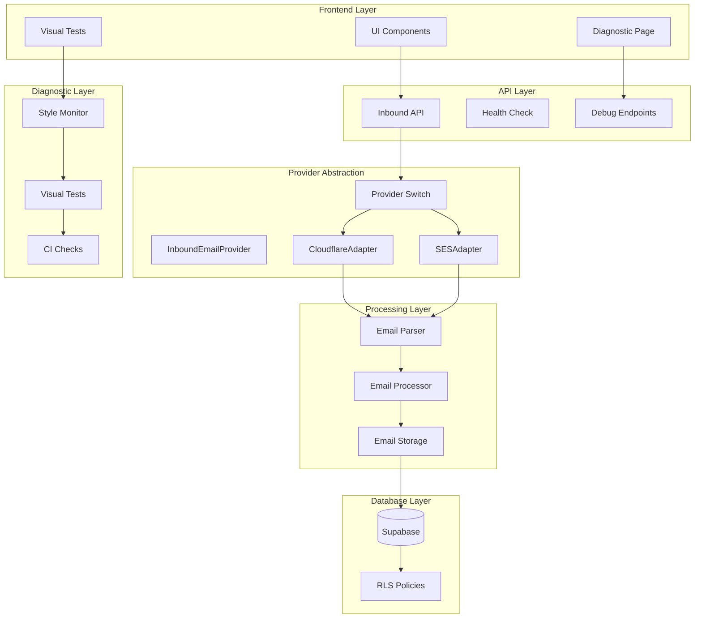
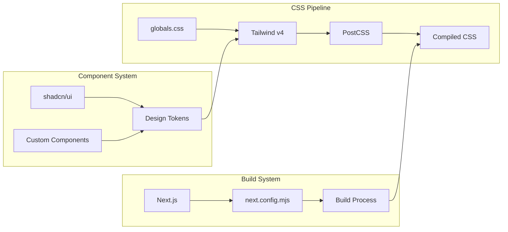

# Design Document

## Overview

This design addresses the critical stability issues in ChiPhi AI's MVP by implementing a three-pronged approach: UI restoration through proper Tailwind CSS configuration, inbound email provider abstraction for deployment flexibility, and comprehensive diagnostic systems to prevent future regressions. The solution maintains backward compatibility while introducing robust safeguards and provider flexibility.

## Architecture

### High-Level System Architecture



### UI Restoration Architecture

The UI restoration focuses on fixing the Tailwind CSS v4 configuration and ensuring proper shadcn/ui integration:



## Components and Interfaces

### InboundEmailProvider Interface

```typescript
// lib/inbound/types.ts
export interface InboundEmailPayload {
  alias: string;          // u_<slug>@inbox.chiphi.ai
  messageId: string;
  from: string;
  to: string;
  subject?: string;
  text?: string;
  html?: string;
  attachments?: Array<{
    name: string;
    contentType: string;
    size: number;
    key?: string;
  }>;
  rawRef?: string;        // storage key when we save raw MIME
}

export interface InboundEmailProvider {
  verify(req: Request): Promise<boolean>;
  parse(req: Request): Promise<InboundEmailPayload>;
}

export interface ProviderConfig {
  name: string;
  enabled: boolean;
  config: Record<string, any>;
}
```

### Provider Implementations

#### CloudflareAdapter
```typescript
// lib/inbound/providers/cloudflare-adapter.ts
export class CloudflareAdapter implements InboundEmailProvider {
  async verify(req: Request): Promise<boolean> {
    // Implement Cloudflare Workers Email Routing verification
    // TODO: Add HMAC verification for Cloudflare
    return true;
  }
  
  async parse(req: Request): Promise<InboundEmailPayload> {
    // Parse Cloudflare email format
    // TODO: Implement Cloudflare-specific parsing
    const body = await req.text();
    return this.normalizePayload(body);
  }
  
  private normalizePayload(body: string): InboundEmailPayload {
    // Normalize to common format
    // TODO: Implement normalization logic
    throw new Error('Not implemented');
  }
}
```

#### SESAdapter
```typescript
// lib/inbound/providers/ses-adapter.ts
export class SESAdapter implements InboundEmailProvider {
  async verify(req: Request): Promise<boolean> {
    // Implement Amazon SES verification
    // TODO: Add SNS signature verification
    return true;
  }
  
  async parse(req: Request): Promise<InboundEmailPayload> {
    // Parse SES SNS notification format
    // TODO: Implement SES-specific parsing
    const body = await req.json();
    return this.normalizePayload(body);
  }
  
  private normalizePayload(snsMessage: any): InboundEmailPayload {
    // Normalize SES format to common format
    // TODO: Implement normalization logic
    throw new Error('Not implemented');
  }
}
```

### Provider Factory and Switch

```typescript
// lib/inbound/provider-factory.ts
export class ProviderFactory {
  static createProvider(providerName: string): InboundEmailProvider {
    switch (providerName) {
      case 'cloudflare':
        return new CloudflareAdapter();
      case 'ses':
        return new SESAdapter();
      default:
        throw new Error(`Unknown provider: ${providerName}`);
    }
  }
}

// Updated API route structure
export async function POST(request: NextRequest) {
  const providerName = process.env.INBOUND_PROVIDER || 'cloudflare';
  const provider = ProviderFactory.createProvider(providerName);
  
  // Verify request
  const isValid = await provider.verify(request);
  if (!isValid) {
    return NextResponse.json({ error: 'Invalid signature' }, { status: 401 });
  }
  
  // Parse payload
  const payload = await provider.parse(request);
  
  // Process with unified logic
  return processInboundEmail(payload);
}
```

### Diagnostic System Components

#### Style Probe Component
```typescript
// app/debug/components/style-probes.tsx
export function StyleProbes() {
  return (
    <div className="space-y-6 p-6">
      <div data-testid="button-probe">
        <Button variant="default">Primary Button</Button>
        <Button variant="secondary">Secondary Button</Button>
        <Button variant="outline">Outline Button</Button>
      </div>
      
      <div data-testid="card-probe">
        <Card className="p-4">
          <CardHeader>
            <CardTitle>Test Card</CardTitle>
          </CardHeader>
          <CardContent>
            <p>Card content with proper styling</p>
          </CardContent>
        </Card>
      </div>
      
      <div data-testid="badge-probe">
        <Badge variant="default">Default Badge</Badge>
        <Badge variant="secondary">Secondary Badge</Badge>
        <Badge variant="destructive">Destructive Badge</Badge>
      </div>
    </div>
  );
}
```

#### Visual Regression Test
```typescript
// tests/visual/ui-regression.spec.ts
import { test, expect } from '@playwright/test';

test.describe('UI Visual Regression', () => {
  test('dashboard renders with correct styling', async ({ page }) => {
    await page.goto('/dashboard');
    
    // Check computed styles
    const button = page.locator('[data-testid="primary-button"]').first();
    const bgColor = await button.evaluate(el => 
      getComputedStyle(el).backgroundColor
    );
    expect(bgColor).not.toBe('rgba(0, 0, 0, 0)'); // Not transparent
    
    const borderRadius = await button.evaluate(el => 
      getComputedStyle(el).borderRadius
    );
    expect(parseFloat(borderRadius)).toBeGreaterThan(0);
    
    // Visual comparison
    await expect(page).toHaveScreenshot('dashboard-baseline.png', {
      threshold: 0.01, // 1% threshold
      maxDiffPixels: 100
    });
  });
  
  test('debug page style probes pass', async ({ page }) => {
    await page.goto('/debug');
    
    // Test button styles
    const buttonProbe = page.locator('[data-testid="button-probe"]');
    await expect(buttonProbe).toBeVisible();
    
    // Test card styles
    const cardProbe = page.locator('[data-testid="card-probe"]');
    const cardBorder = await cardProbe.locator('.border').first().evaluate(el =>
      getComputedStyle(el).borderWidth
    );
    expect(parseFloat(cardBorder)).toBeGreaterThan(0);
    
    // Visual snapshot
    await expect(page.locator('[data-testid="style-probes"]')).toHaveScreenshot(
      'style-probes.png'
    );
  });
});
```

## Data Models

### Configuration Schema Updates

```typescript
// lib/config.ts - Add inbound provider config
const envSchema = z.object({
  // ... existing config
  
  // Inbound Email Provider
  INBOUND_PROVIDER: z.enum(['cloudflare', 'ses']).default('cloudflare'),
  CLOUDFLARE_EMAIL_SECRET: z.string().optional(),
  SES_WEBHOOK_SECRET: z.string().optional(),
  
  // Visual Testing
  VISUAL_REGRESSION_THRESHOLD: z.coerce.number().min(0).max(1).default(0.01),
  ENABLE_VISUAL_TESTS: z.coerce.boolean().default(true),
  
  // Diagnostic Settings
  ENABLE_DEBUG_ENDPOINTS: z.coerce.boolean().default(false),
  STYLE_PROBE_ENABLED: z.coerce.boolean().default(true),
});
```

### Database Schema Updates

```sql
-- Migration: Add provider tracking
CREATE TABLE IF NOT EXISTS email_provider_logs (
  id UUID PRIMARY KEY DEFAULT gen_random_uuid(),
  org_id UUID NOT NULL REFERENCES organizations(id),
  provider_name TEXT NOT NULL,
  message_id TEXT NOT NULL,
  payload JSONB NOT NULL,
  processed_at TIMESTAMP WITH TIME ZONE DEFAULT NOW(),
  processing_time_ms INTEGER,
  success BOOLEAN NOT NULL,
  error_message TEXT,
  
  CONSTRAINT unique_message_per_org UNIQUE (org_id, message_id)
);

-- Add RLS policy
ALTER TABLE email_provider_logs ENABLE ROW LEVEL SECURITY;

CREATE POLICY "Users can only access their org's provider logs"
  ON email_provider_logs
  FOR ALL
  USING (
    org_id IN (
      SELECT org_id FROM org_members 
      WHERE user_id = auth.uid()
    )
  );

-- Migration: Add diagnostic tables
CREATE TABLE IF NOT EXISTS diagnostic_checks (
  id UUID PRIMARY KEY DEFAULT gen_random_uuid(),
  check_type TEXT NOT NULL,
  check_name TEXT NOT NULL,
  status TEXT NOT NULL CHECK (status IN ('pass', 'fail', 'warning')),
  details JSONB,
  checked_at TIMESTAMP WITH TIME ZONE DEFAULT NOW(),
  
  INDEX idx_diagnostic_checks_type_time (check_type, checked_at)
);
```

## Error Handling

### Provider Error Handling

```typescript
// lib/inbound/error-handler.ts
export class ProviderErrorHandler {
  static async handleProviderError(
    error: Error,
    provider: string,
    payload: Partial<InboundEmailPayload>
  ): Promise<void> {
    // Log provider-specific error
    await loggingService.logProcessingStep({
      orgId: payload.alias ? this.extractOrgFromAlias(payload.alias) : undefined,
      emailId: payload.messageId,
      step: `${provider}_provider_error`,
      status: 'failed',
      details: {
        provider,
        error: error.message,
        stack: error.stack,
        payload: this.sanitizePayload(payload),
      },
    });
    
    // Attempt fallback processing if available
    if (this.hasFallbackProvider(provider)) {
      await this.tryFallbackProvider(payload);
    }
  }
  
  private static hasFallbackProvider(currentProvider: string): boolean {
    // Check if alternative provider is configured
    return currentProvider === 'cloudflare' && 
           process.env.SES_WEBHOOK_SECRET !== undefined;
  }
}
```

### Visual Regression Error Handling

```typescript
// lib/diagnostic/visual-regression.ts
export class VisualRegressionHandler {
  static async handleRegressionFailure(
    testName: string,
    actualPath: string,
    expectedPath: string,
    diffPath: string
  ): Promise<void> {
    // Store regression data
    await this.storeRegressionResult({
      testName,
      status: 'fail',
      actualPath,
      expectedPath,
      diffPath,
      timestamp: new Date(),
    });
    
    // Notify development team
    if (process.env.NODE_ENV === 'production') {
      await this.notifyRegressionFailure(testName, diffPath);
    }
  }
}
```

## Testing Strategy

### Unit Testing Strategy

1. **Provider Interface Testing**
   - Test each provider adapter independently
   - Mock external dependencies (Cloudflare, SES)
   - Verify payload normalization accuracy
   - Test error handling scenarios

2. **Configuration Testing**
   - Test environment variable validation
   - Test provider factory creation
   - Test feature flag behavior

3. **Style System Testing**
   - Test CSS variable resolution
   - Test component style application
   - Test theme switching functionality

### Integration Testing Strategy

1. **Provider Integration Tests**
   - Test full email processing pipeline
   - Test provider switching functionality
   - Test idempotency enforcement
   - Test multi-tenant isolation

2. **Visual Regression Tests**
   - Baseline screenshot generation
   - Cross-browser compatibility testing
   - Responsive design verification
   - Theme consistency testing

### End-to-End Testing Strategy

1. **Email Processing Workflow**
   - Test complete email-to-transaction flow
   - Test provider failover scenarios
   - Test rate limiting behavior
   - Test error recovery mechanisms

2. **UI Consistency Testing**
   - Test dashboard rendering across browsers
   - Test component library integration
   - Test accessibility compliance
   - Test performance metrics

### Performance Testing

1. **Provider Performance**
   - Measure email processing latency
   - Test concurrent email handling
   - Monitor memory usage patterns
   - Test provider switching overhead

2. **UI Performance**
   - Measure page load times
   - Test CSS bundle size
   - Monitor runtime performance
   - Test mobile responsiveness

## Security Considerations

### Provider Security

1. **Signature Verification**
   - Implement HMAC verification for each provider
   - Use provider-specific secret keys
   - Implement replay attack prevention
   - Log all verification failures

2. **Input Validation**
   - Validate all provider payloads
   - Sanitize email content
   - Implement size limits
   - Prevent injection attacks

### Multi-tenant Security

1. **Data Isolation**
   - Enforce RLS policies on all tables
   - Validate organization access
   - Implement audit logging
   - Test cross-tenant access prevention

2. **API Security**
   - Rate limiting per organization
   - Request size limitations
   - Timeout enforcement
   - Error message sanitization

## Deployment Strategy

### Environment Configuration

1. **Development Environment**
   - Enable debug endpoints
   - Use Cloudflare provider by default
   - Enable visual regression testing
   - Use development Supabase project

2. **Production Environment**
   - Disable debug endpoints
   - Configure production provider
   - Enable monitoring and alerting
   - Use production Supabase project

### Migration Strategy

1. **Database Migration**
   - Update Supabase project configuration
   - Apply new RLS policies
   - Migrate existing data if needed
   - Verify multi-tenant isolation

2. **Provider Migration**
   - Deploy with feature flag disabled
   - Test provider functionality
   - Gradually enable new provider
   - Monitor error rates and performance

3. **UI Migration**
   - Fix Tailwind configuration
   - Update component imports
   - Test visual consistency
   - Deploy with visual regression tests

## Monitoring and Observability

### Application Monitoring

1. **Provider Metrics**
   - Email processing success rates
   - Provider response times
   - Error rates by provider
   - Failover frequency

2. **UI Metrics**
   - Page load times
   - CSS bundle size
   - Component render times
   - Visual regression test results

### Health Checks

1. **System Health**
   - Database connectivity
   - Provider availability
   - Queue system status
   - Storage system health

2. **Visual Health**
   - CSS compilation status
   - Component library integrity
   - Theme consistency
   - Accessibility compliance